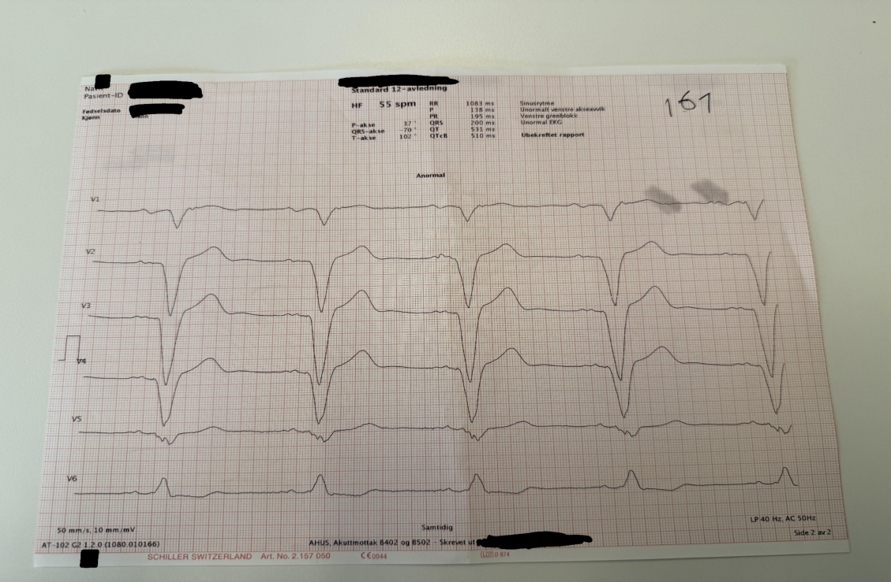
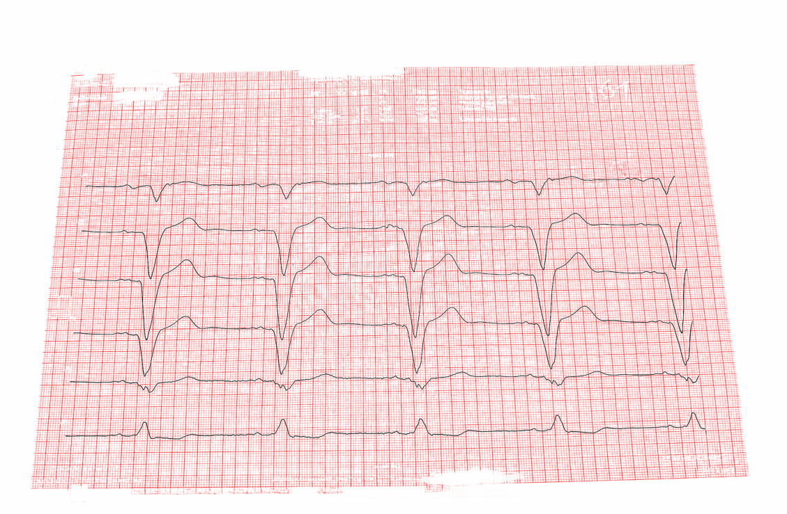
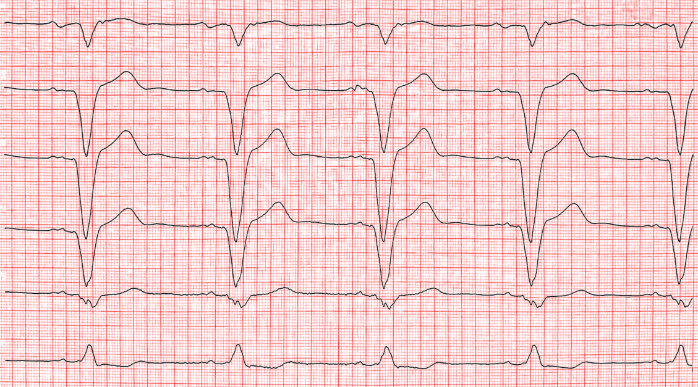
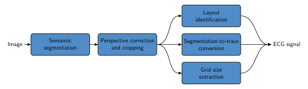

# Open ECG Digitizer

[](https://arxiv.org/abs/2510.19590)  [](https://www.python.org/downloads/release/python-31211/)

Digitizes 12-lead ECG paper records (scanned or photographed) into raw voltage–time series data. Handles perspective distortion, any lead subset, and is configurable via YAML.

<div style="display: flex; justify-content: center; gap: 30px;">
  
  
  
</div>

---

## Prerequisites

- Python 3.12+
- Git

---

## Setup

### Windows (PowerShell)

```powershell
git clone https://github.com/DevaP06/Electrocardiogram-Digitization.git
cd Electrocardiogram-Digitization

python -m venv venv
Set-ExecutionPolicy -Scope Process -ExecutionPolicy RemoteSigned
.\venv\Scripts\Activate.ps1

pip install torch==2.12.0 torchvision==0.27.0 --index-url https://download.pytorch.org/whl/cpu
pip install -r requirements.txt
```

> **Weights:** Model weights are not included in this repository. Contact [ecgenius.life@gmail.com](mailto:ecgenius.life@gmail.com) to obtain them and place them in the `weights/` folder.

### Linux / macOS

```bash
git clone https://github.com/DevaP06/Electrocardiogram-Digitization.git
cd Electrocardiogram-Digitization

python3.12 -m venv venv && source venv/bin/activate

pip install torch==2.12.0 torchvision==0.27.0 --index-url https://download.pytorch.org/whl/cpu
pip install -r requirements.txt
```

> **GPU (CUDA):** Replace the `--index-url` with `https://download.pytorch.org/whl/cu121` (or your CUDA version).

---

## Running Inference

### Batch processing (CLI)

Place your ECG images in a folder and run:

```bash
python -m src.digitize --config src/config/inference_wrapper_ahus_testset.yml
```

Override input/output paths without editing the config:

```bash
python -m src.digitize --config src/config/inference_wrapper_ahus_testset.yml \
  DATA.images_path=./my_images/ \
  DATA.output_path=./my_results/
```

**Output** (written to `results/` by default):
- `*_timeseries_canonical.csv` — digitized signal in **microvolts (µV)**
- `*.png` — visualization overlays
- `digitization_metadata.csv` — layout match scores per image

### REST API (FastAPI)

```bash
uvicorn app.main:app --reload --port 8000
```

Endpoints:
- `POST /digitize` — upload an ECG image, returns full digitization result
- `POST /extract-signal` — upload an ECG image, returns signal timeseries only
- `GET /` — health check

Interactive docs available at `http://localhost:8000/docs`.

### Docker

```bash
docker build -t ecg-digitizer .
docker run -p 8000:8000 ecg-digitizer
```

---

## Configuration

The default config is [`src/config/inference_wrapper_ahus_testset.yml`](src/config/inference_wrapper_ahus_testset.yml). Key fields:

| Field | Default | Description |
|---|---|---|
| `DATA.images_path` | `./test_images/` | Input folder |
| `DATA.output_path` | `./results/` | Output folder |
| `DATA.image_extensions` | `[.png,.jpg,.jpeg]` | Accepted formats |
| `MODEL.KWARGS.config.device` | `cpu` | `cpu` or `cuda` |
| `MODEL.KWARGS.config.resample_size` | `3000` | Output samples per lead |

Lead layout templates are in `src/config/lead_layouts_*.yml`. Point `LAYOUT_IDENTIFIER.config_path` at the right file for your ECG format.

---

## Training on a Custom Dataset

1. Update `data_path` for TRAIN, VAL, and TEST in [`src/config/unet.yml`](src/config/unet.yml).
2. Run:

```bash
python -m src.train
```

The public training dataset is on Hugging Face:  
[huggingface.co/datasets/Ahus-AIM/Open-ECG-Digitizer-Development-Dataset](https://huggingface.co/datasets/Ahus-AIM/Open-ECG-Digitizer-Development-Dataset)

---

## Pipeline Overview

<p align="center">
  
</p>

| Module | Role |
|---|---|
| [`src/model/unet.py`](src/model/unet.py) | U-Net segmentation (traces / grid / background) |
| [`src/model/perspective_detector.py`](src/model/perspective_detector.py) | Projective distortion correction |
| [`src/model/cropper.py`](src/model/cropper.py) | Lead region bounding box extraction |
| [`src/model/pixel_size_finder.py`](src/model/pixel_size_finder.py) | Grid size estimation via autocorrelation |
| [`src/model/lead_identifier.py`](src/model/lead_identifier.py) | Layout matching against templates |
| [`src/model/signal_extractor.py`](src/model/signal_extractor.py) | Segmentation → voltage–time trace |
| [`src/model/inference_wrapper.py`](src/model/inference_wrapper.py) | Pipeline orchestration |

---

## Citation

```bibtex
@article{stenhede_digitizing_2026,
  title     = {Digitizing Paper {ECGs} at Scale: An Open-Source Algorithm for Clinical Research},
  author    = {Stenhede, Elias and Bjørnstad, Agnar Martin and Ranjbar, Arian},
  journal   = {npj Digital Medicine},
  year      = {2026},
  doi       = {10.1038/s41746-025-02327-1},
  url       = {https://doi.org/10.1038/s41746-025-02327-1}
}
```


